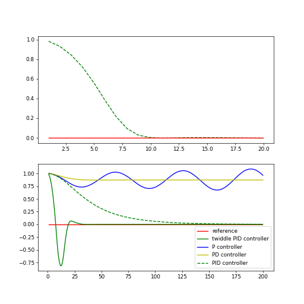

# PID Controller Project

The goal of this project is to add a PID controller with appropriate parameters to allow the car simulation to successfully complete a lap of the test course.

### Code modifications and additions

The `PID` class constructer, `UpdateError()` and `Correction()` methods were completed to provide a generalized PID controller framework (`PID.h` and `PID.cpp`).

The file `main.cpp` was modified to construct a PID instance initialized with parameters Kp, Ki, Kd, and N (see `PID.h` for parameter documentation). Within the update loop, `UpdateError()` is called with the updated cross track error. `Correction()` then returns the new steer angle.

### Parameter selection process

I used a hybrid approach: I used the `twiddle()` optimizer from lesson 14 "Parameter Optimization" to select initial parameter values, then manually tuned from there.

The `twiddle()` code is given below. I found I obtained better results when using the initial values from lesson 11 "PID Implementation."
```python
# Make this tolerance bigger if you are timing out!
def twiddle(tol=0.01): 
    p = [0.2, 3.0, 0.004]
    dp = [0.1, 1.5, 0.002]
    #p = [0.2, 3.0, 0.0]
    #dp = [0.1, 1.5, 0.0]
    #p = [0, 0, 0]
    #dp = [1.0, 1.0, 1.0]
    robot = make_robot()
    x_trajectory, y_trajectory, best_err = run(robot, p)

    it = 0
    while sum(dp) > tol:
        #print("Iteration {}, best error = {}".format(it, best_err))
        #print(p)
        for i in range(len(p)):
            p[i] += dp[i]
            robot = make_robot()
            x_trajectory, y_trajectory, err = run(robot, p)

            if err < best_err:
                best_err = err
                dp[i] *= 1.1
            else:
                p[i] -= 2 * dp[i]
                robot = make_robot()
                x_trajectory, y_trajectory, err = run(robot, p)

                if err < best_err:
                    best_err = err
                    dp[i] *= 1.1
                else:
                    p[i] += dp[i]
                    dp[i] *= 0.9
        it += 1
    return p, best_err
```

The optimal solution was given as:

`Final twiddle error = 3.0519334332727137e-06
[2.793219409694487, 8.877885854779068, 0.03125677119852825]`

The figures below compare the performance of my optimal solution versus the solution presented in lesson 14. My optimal solution has no overshoot and  converges to zero much quicker (note the horizontal scale differs).



I used the manual tuning methodology outlined here: https://discussions.udacity.com/t/how-to-tune-parameters/303845/4.

From the optimization results, I targeted initial values of [Kp, Kd, Ki] = [3, 9, 0.03]. My first attempt left Kp = 3, but set Kd and Ki to zero. Initially, I saw less stability as speed increased. To mitigate this complication, I added code (line 79 in `main.cpp`) to limit speed to 20 and throttle to 0.1. Success! 

There was some weaving in the corners I hoped would be suppressed by the addition of Kd. Using Kd = 9 did not improve the observed performance. Dropping Kd to 3, then 1 showed minimal improvement. This consistency was in marked contrast to the result when adding Ki = 0.03. The simulated car immediately veered off the roadway. Dropping Ki to 0.003 allowed the car to navigate the course successfully.

### Parameter Effects

The Kp parameter controls how quickly the steering reacts to any CTE. This was visible in the initial offset when starting and as the car entered the turns. With Kd set to zero, I expected more overshoot from the initial offset but the car converged quickly to the roadway centerline. 

In contrast, the car would weave while tracking in the corners and the weaving would only diminish once the turn was completed. I expected the Kd coefficient to affect the weaving behavior, but at least for the range of values I considered, the effect was minimal.

Lastly, I was surprised at the effect of Ki when using the twiddle-suggested value. The need for very little Ki correction may be due to a lack of an offset error (steering drift) in the simulation. Interestingly. the steering inputs seem to exhibit seemingly random impulses. If the simulation input is noisy, then smoothing might be useful.

